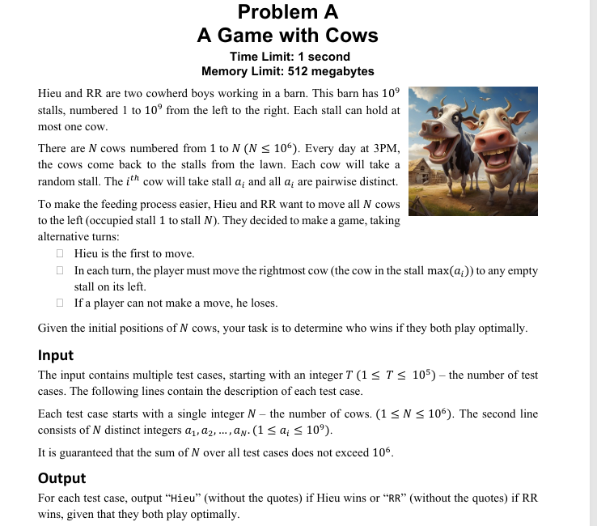
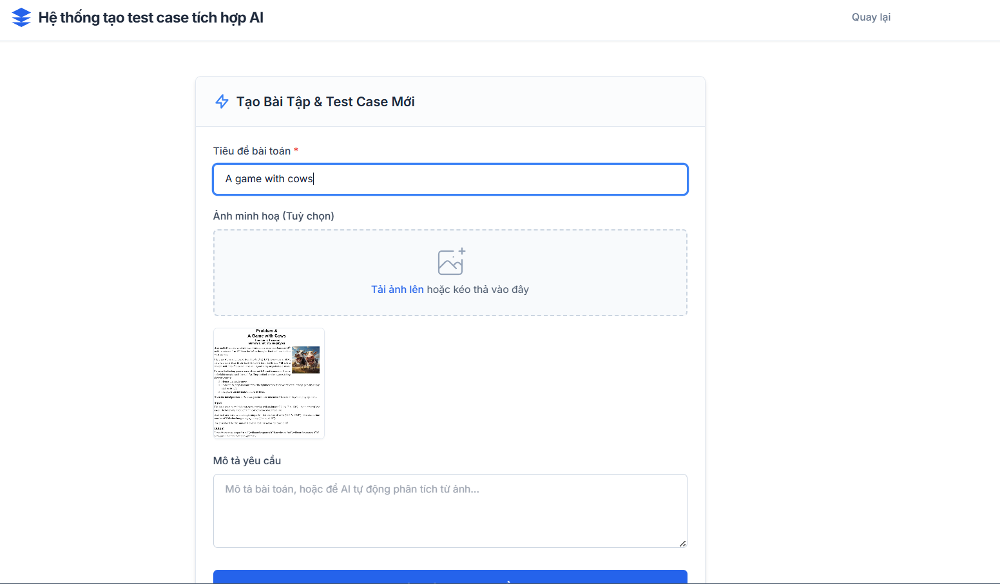
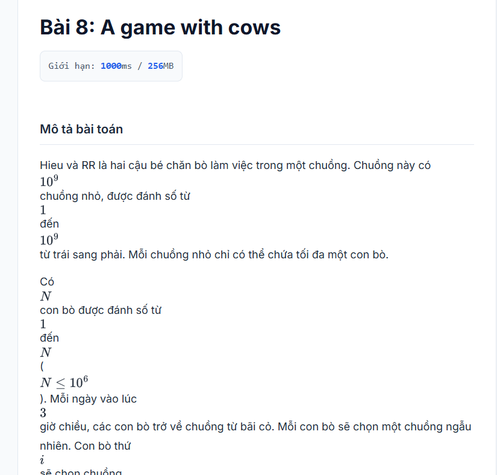
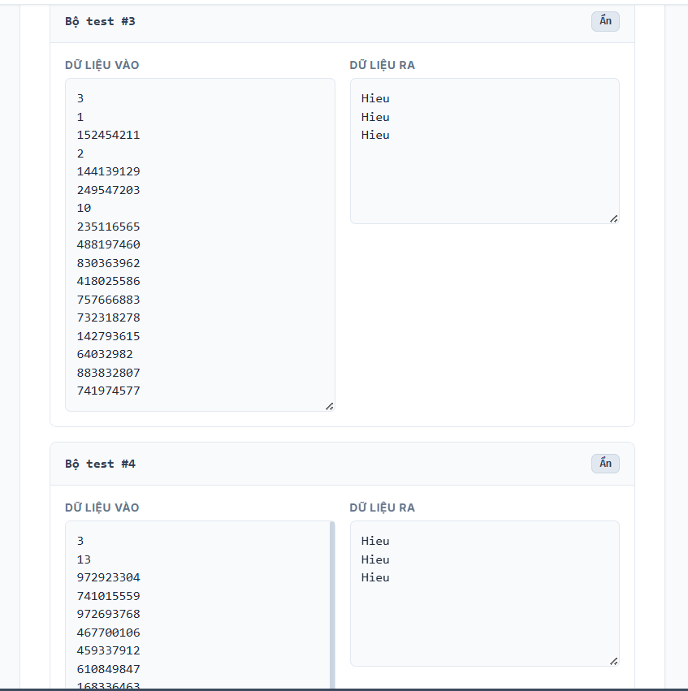
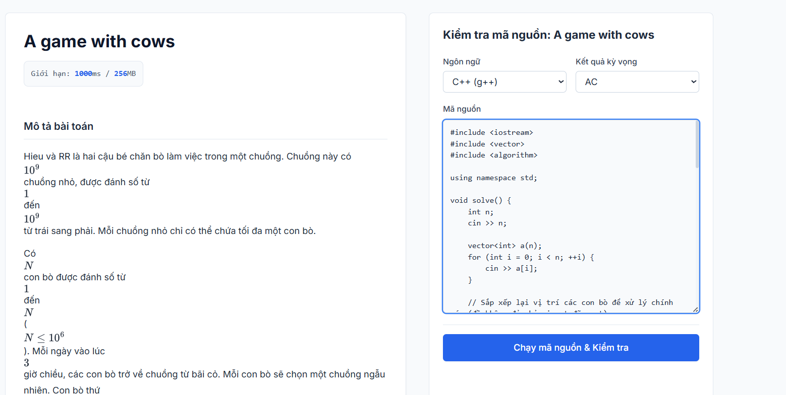
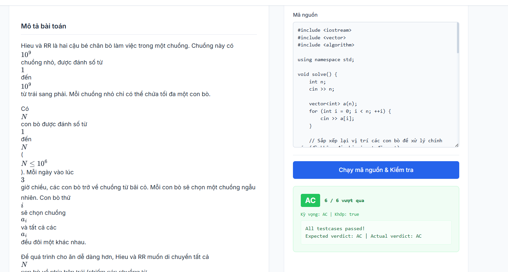
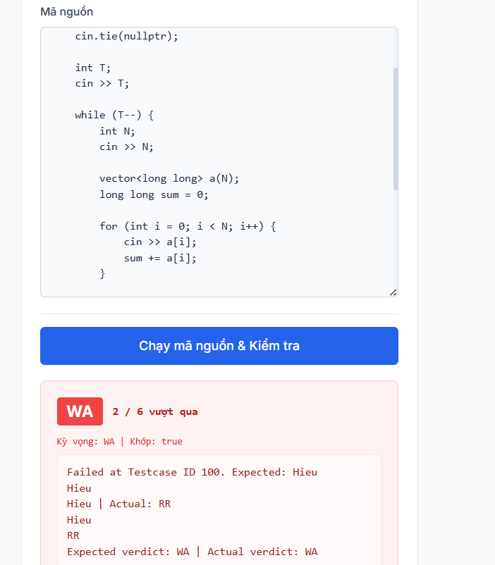
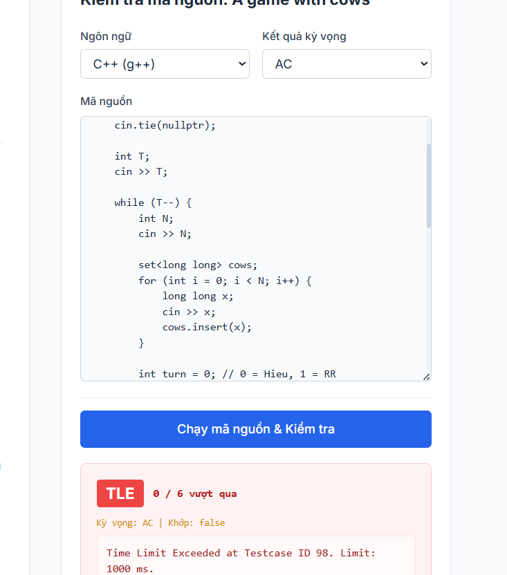
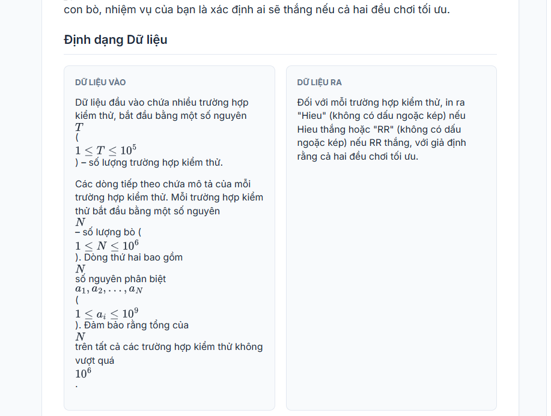
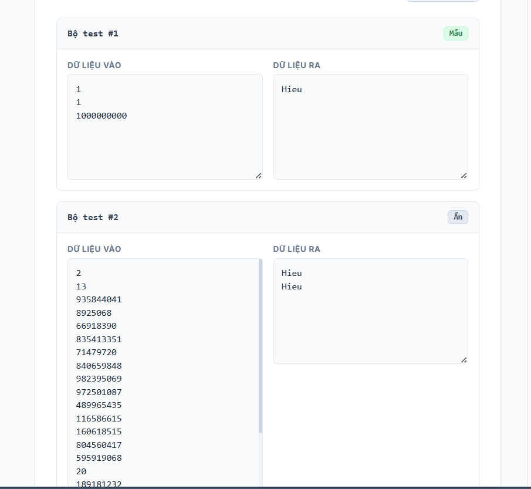

<<<<<<< HEAD

=======
# PBJ Judge

Hệ thống hỗ trợ sinh test case tự động bằng AI cho bài toán lập trình thi đấu, hỗ trợ kiểm tra lời giải với các trạng thái **AC / WA / TLE**.

## Demo từ báo cáo






















---

## Công nghệ sử dụng

- Java 21
- Spring Boot 3.2
- MySQL 8.4
- Docker Compose
- Ollama
- Gemini API

---

## Tổng quan hệ thống

PBJ Judge hỗ trợ:

- Nhập đề bài bằng text hoặc ảnh
- OCR đề bằng Gemini
- Phân tích bài toán bằng AI
- Sinh test case tự động
- Kiểm tra code với sandbox
- Hỗ trợ các kết quả: **AC**, **WA**, **TLE**, **RE**, **CE**

---

## Kiến trúc AI

### Ollama local

Dùng để:

- Phân tích nhanh đề bài
- Xác định loại bài
- Sinh schema cơ bản

### Gemini

Dùng để:

- OCR ảnh đề
- Chuẩn hóa metadata
- Sinh test plan
- Sinh golden solution
- Sinh validator

---

## Yêu cầu môi trường

| Công cụ | Phiên bản khuyến nghị | Mục đích |
|---|---:|---|
| Git | 2.40+ | Clone source, quản lý branch |
| JDK | 21 LTS | Build và chạy Spring Boot |
| Maven | 3.9+ | Tải dependency, chạy test, đóng gói jar |
| Docker Desktop | 4.x+ | Chạy app và MySQL bằng Docker Compose |
| Ollama | Latest | Chạy model local |

### Kiểm tra nhanh

```bash
java -version
mvn -version
git --version
docker --version
docker compose version
ollama --version
```

---

## Cấu hình môi trường

Tạo file `.env` ở thư mục gốc:

```env
GEMINI_API_KEY=your_gemini_api_key
GEMINI_API_KEYS=
GEMINI_MODEL=gemini-2.5-flash
GEMINI_PRO_MODEL=gemini-2.5-flash
GEMINI_TIMEOUT_SECONDS=240

OLLAMA_BASE_URL=http://host.docker.internal:11434
OLLAMA_MODEL=deepseek-coder:6.7b

AI_QUEUE_MAX_CONCURRENCY=1
```

> Không commit file `.env` hoặc API key lên GitHub.

---

## Cài đặt Ollama

```bash
ollama pull deepseek-coder:6.7b
ollama list
ollama serve
```

---

## Chạy bằng Docker

### Clone repository

```bash
git clone https://github.com/your-username/pbj-judge.git
cd pbj-judge
```

### Build và chạy hệ thống

```bash
docker compose up -d --build
```

### Kiểm tra container

```bash
docker ps
docker compose logs -f app
```

### Port hệ thống

| Service | Port trên máy host | Ghi chú |
|---|---:|---|
| app | 8080 | Web UI |
| mysql-master | 3307 | MySQL chính |
| mysql-slave | 3308 | MySQL phụ |

---

## Các lệnh vận hành thường dùng

```bash
# Xem log app
docker logs pbj-judge-app --tail 100 -f

# Restart app mà không xoá database
docker compose restart app

# Rebuild app sau khi sửa code
docker compose up -d --build app

# Dừng hệ thống, giữ dữ liệu
docker compose down

# Dừng và xoá cả volume/container data do Docker quản lý
docker compose down -v
```

---

## Chạy local

Main class:

```text
com.pbj.PbjApplication
```

Environment variables:

```env
GEMINI_API_KEY=...
OLLAMA_BASE_URL=http://localhost:11434
OLLAMA_MODEL=deepseek-coder:6.7b
```

---

## Hướng dẫn sử dụng hệ thống sinh test case

### Tạo bài mới

1. Truy cập `http://localhost:8080`
2. Chọn **Tạo bài mới**
3. Nhập tiêu đề bài toán
4. Nhập mô tả đề bài, input, output, constraints và sample
5. Có thể upload ảnh đề bài để Gemini OCR
6. Bấm **Phân Tích & Tạo Đề**

### Pipeline sinh test case

1. Nhận đề bài dạng text hoặc ảnh
2. OCR ảnh đề bằng Gemini
3. Ollama phân tích nhanh loại bài, ràng buộc và cấu trúc input
4. Gemini chuẩn hoá metadata, sinh schema, test plan và golden oracle
5. Backend dựng validator local từ schema
6. Hệ thống sinh test theo nhiều profile: sample, basic, edge, boundary, random, stress/adversarial
7. Golden solution chạy trong sandbox để tạo output
8. Validator kiểm tra input/output trước khi lưu

---

## Chạy code để kiểm tra

Hệ thống hỗ trợ:

- C++
- Java
- Python

Các kết quả hỗ trợ:

- AC
- WA
- TLE
- CE
- RE

---

## API chính

| API | Chức năng |
|---|---|
| `POST /api/problem/generate` | Sinh đề và test case |
| `GET /api/job/{id}` | Kiểm tra trạng thái job |
| `POST /api/problem/run` | Chạy code |
| `POST /api/problem/regenerate-testcases` | Sinh lại test case |

---

## Trạng thái job

| Trạng thái | Ý nghĩa | Việc cần làm |
|---|---|---|
| `RUNNING` | AI/backend đang xử lý | Giữ tab mở, xem log nếu quá lâu |
| `DONE` | Tạo bài và test case thành công | Giao diện chuyển tới trang chi tiết bài |
| `NEEDS_INPUT` | Thiếu thông tin quan trọng | Bổ sung Input/Output/Constraints |
| `FAILED` | Có lỗi khi xử lý | Xem log app và thử lại |

---

## Ví dụ code AC

```cpp
#include <iostream>
#include <vector>
#include <algorithm>
using namespace std;

void solve() {
    int n;
    cin >> n;

    vector<int> a(n);
    for (int i = 0; i < n; ++i) {
        cin >> a[i];
    }

    sort(a.begin(), a.end());

    int empty_stalls = a[n - 1] - n;

    if (empty_stalls == 0) {
        cout << "RR\n";
        return;
    }

    int last_gap = a[n - 1] - a[n - 2] - 1;

    if (last_gap > 0) {
        cout << "Hieu\n";
    } else {
        if (empty_stalls % 2 != 0) {
            cout << "Hieu\n";
        } else {
            cout << "RR\n";
        }
    }
}

int main() {
    ios_base::sync_with_stdio(false);
    cin.tie(NULL);

    int t;
    cin >> t;

    while (t--) {
        solve();
    }

    return 0;
}
```

---

## Ví dụ code WA

```cpp
long long target = 1LL * N * (N + 1) / 2;
long long moves = sum - target;

if (moves % 2 == 1)
    cout << "Hieu\n";
else
    cout << "RR\n";
```

---

## Ví dụ code TLE

```cpp
while (true) {
    long long pos = *cows.rbegin();
    long long target = -1;

    for (long long i = pos - 1; i >= 1; i--) {
        if (!cows.count(i)) {
            target = i;
            break;
        }
    }

    if (target == -1) {
        break;
    }

    cows.erase(pos);
    cows.insert(target);
    turn ^= 1;
}
```

---

## Xử lý lỗi thường gặp

### Không truy cập được `http://localhost:8080`

```bash
docker ps
docker logs pbj-judge-app --tail 100
```

Nếu port bị chiếm, đổi mapping trong `docker-compose.yml` từ `8080:8080` sang `8081:8080`.

### Lỗi kết nối MySQL

```bash
docker compose logs -f mysql-master
docker compose restart app
```

### Gemini báo 401, 403 hoặc hết quota

Kiểm tra lại `GEMINI_API_KEY` trong file `.env`, sau đó restart app:

```bash
docker compose up -d --build app
```

### Ollama không phản hồi

```bash
ollama list
ollama pull deepseek-coder:6.7b
ollama serve
```

Nếu chạy app trong Docker, dùng:

```env
OLLAMA_BASE_URL=http://host.docker.internal:11434
```

Nếu chạy app local ngoài Docker, dùng:

```env
OLLAMA_BASE_URL=http://localhost:11434
```

### Maven build failure

```bash
java -version
mvn -version
mvn clean package -DskipTests -U
```

Đảm bảo Java đang là JDK 21.

---

## Ghi chú

- File `.env` nên nằm trong `.gitignore`
- Không commit API key lên GitHub
- Docker Desktop cần được bật trước khi chạy `docker compose up`
- Test case được lưu trong volume `testcase-data`

---

## License

MIT License
>>>>>>> 195c676 (commit 19)
